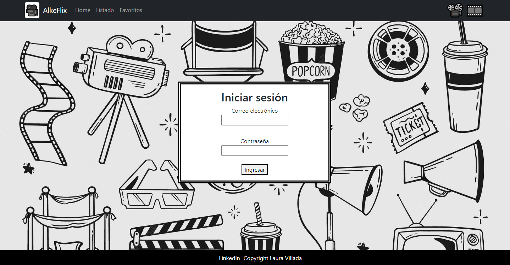
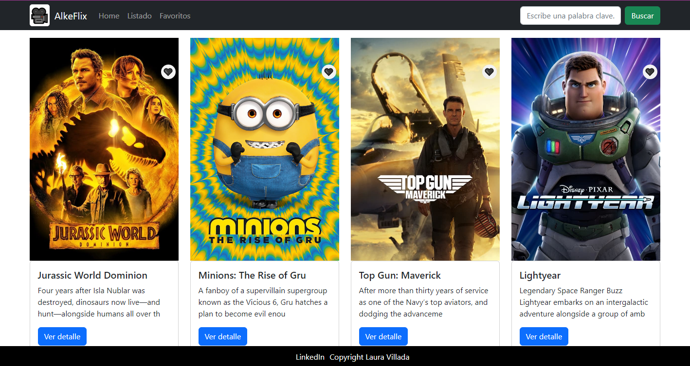

# Alkemy Skill-up Project 

This project was developed during the skill-up course in the Alkemy platform. In the application, authentication was performed with token storage in the local storage, API requests, conditional rendering, form development and validation. All this was implemented with the axios and react-router-dom libraries.

The app is available at https://lavilladaa.github.io/movies-web/

## App screen :pager:

## App screen :pager:

